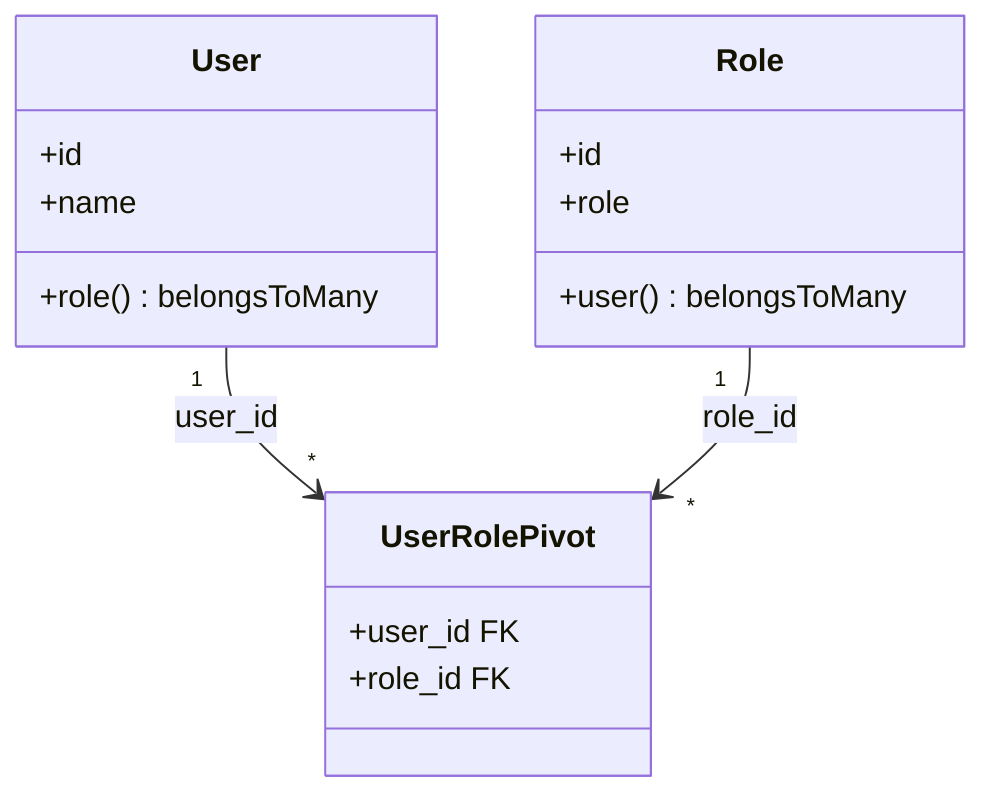

# Laravel Many-to-Many Eloquent Relationship

A comprehensive and production-ready implementation of a bidirectional **Many-to-Many Eloquent Relationship** using **Laravel 12** and **PHP 8.2+**. This project demonstrates how to connect, query, and synchronize data between two primary models (**Users** and **Roles**) via an intermediary pivot table (`user_role`). It covers advanced association operations like `attach()` and `sync()`.

---

## 🛠️ Technology Stack & Dependencies


---

## 🚀 Key Features

*   **BelongsToMany Bidirectional Mapping**: Seamlessly links users and roles in a many-to-many matrix (`User` can have multiple roles, and `Role` can be assigned to multiple users).
*   **Dynamic Pivot Sync (`sync()`)**: Showcases `sync($roleIds)` to automatically update associations on the pivot table, adding new ones, keeping current ones, and detaching absent ones.
*   **Targeted Pivot Attach (`attach()`)**: Demonstrates `attach($roleIds)` to directly append associations to a model.
*   **Cascading Referential Integrity**: Uses foreign key constraints on the pivot table (`onDelete('cascade')`) to ensure database health: when a user or role is deleted, all pivot table association entries are automatically cleaned up.
*   **Eager Relation Resolution**: Employs Eloquent's relationship loaders to easily fetch records with their corresponding collections without running into N+1 query performance problems.

---

## 📐 Relationship Architecture

This structure manages many-to-many mappings using an intermediary junction / pivot table (`user_role`):



---

## 📂 Repository File Directory

```
Many-to-Many-Relation-Laravel/
├── app/
│   ├── Http/
│   │   └── Controllers/
│   │       ├── Controller.php        # Base controller
│   │       ├── UserController.php    # Resolves user roles & showcases attach()
│   │       └── RoleController.php    # Resolves role users & showcases sync()
│   └── Models/
│       ├── User.php                  # User Model with belongsToMany(Role) relationship
│       ├── Role.php                  # Role Model with belongsToMany(User) relationship
│       └── user_role.php             # Intermediary Pivot Model
├── database/
│   └── migrations/
│       ├── ..._create_users_table.php     # Users migration (id, name)
│       ├── ..._create_roles_table.php     # Roles migration (id, role [unique])
│       └── ..._create_user_role_table.php # Intermediary pivot table with cascade on delete
├── routes/
│   ├── web.php                       # Declares resource routes for users and roles
│   └── console.php                   # Command-line configuration settings
└── composer.json                     # Composer PHP dependency package list
```

---

## 📝 Key Source Code Showcases

### 1. Model Definitions Establishing the Relationship

```php
// app/Models/User.php (Belongs to many Roles)
namespace App\Models;

use Illuminate\Database\Eloquent\Model;
use Illuminate\Database\Eloquent\Factories\HasFactory;

class User extends Model
{
    use HasFactory;
    public $timestamps = false;
    protected $guarded = [];

    public function role()
    {
        return $this->belongsToMany(Role::class, 'user_role');
    }
}

// app/Models/Role.php (Belongs to many Users)
namespace App\Models;

use Illuminate\Database\Eloquent\Model;
use Illuminate\Database\Eloquent\Factories\HasFactory;

class Role extends Model
{
    use HasFactory;
    public $timestamps = false;
    protected $guarded = [];

    public function user()
    {
        return $this->belongsToMany(User::class, 'user_role');
    }
}
```

### 2. Attaching Associations ([UserController.php](file:///d:/for%20CV/My%20learnings/Many-to-Many-Relation-Laravel/app/Http/Controllers/UserController.php))
Demonstrates querying users and appending specific role IDs using the `attach` method:
```php
public function index()
{
    $users = User::get();

    foreach ($users as $user) {
        echo "<h3>Name : $user->name</h3>";
        echo "Roles : ";

        foreach ($user->role as $role) {
            echo $role->role . " | ";
        }
        echo "<hr>";
    }
}

public function create()
{
    // Retrieve user with ID 2 and append roles with IDs 2 and 5
    $user = User::find(2);
    $roles = [2, 5];

    $user->role()->attach($roles);
    echo "Roles successfully attached to User #2!";
}
```

### 3. Synchronizing Associations ([RoleController.php](file:///d:/for%20CV/My%20learnings/Many-to-Many-Relation-Laravel/app/Http/Controllers/RoleController.php))
Demonstrates querying roles and dynamically synchronizing user IDs using the `sync` method:
```php
public function index()
{
    $roles = Role::get();

    foreach ($roles as $role) {
        echo "<h3>Role : $role->role</h3>";
        echo "Users : ";
        foreach ($role->user as $user) {
            echo $user->name . " | ";
        }
        echo "<hr>";
    }
}

public function create()
{
    // Retrieve role with ID 4 and synchronize it to match exactly user IDs 4, 5, and 2
    $role = Role::find(4);
    $users = [4, 5, 2];

    $role->user()->sync($users);
    echo "Role #4 successfully synchronized with Users!";
}
```

---

## 💾 Relational Schema Definition

### 1. `users` Table
*   `id` (Big Integer, Primary Key)
*   `name` (String)

### 2. `roles` Table
*   `id` (Big Integer, Primary Key)
*   `role` (Unique String)

### 3. `user_role` Pivot Table
*   `user_id` (Foreign Key referencing `users.id` with cascade deletion)
*   `role_id` (Foreign Key referencing `roles.id` with cascade deletion)

---

## 🚀 Setup & Execution Guide

### Prerequisites
Make sure the following are installed:
*   **PHP** version 8.2 or higher
*   **Composer** (PHP dependency manager)
*   An active database server (**MySQL / MariaDB**) or **SQLite**.

### Installation & Run Steps
1.  **Clone the Repository**:
    ```bash
    git clone https://github.com/Imtiaz-Ali17314/Many-to-Many-Relation-Laravel.git
    cd Many-to-Many-Relation-Laravel
    ```
2.  **Install Composer Dependencies**:
    ```bash
    composer install
    ```
3.  **Create Environment Configuration**:
    ```bash
    cp .env.example .env
    ```
4.  **Generate Secure Application Key**:
    ```bash
    php artisan key:generate
    ```
5.  **Configure Database**:
    Open the `.env` file and set up your preferred database. For SQLite:
    ```env
    DB_CONNECTION=sqlite
    ```
6.  **Run Database Migrations**:
    ```bash
    php artisan migrate
    ```
7.  **Start Local Development Server**:
    ```bash
    php artisan serve
    ```
    Access the relations and test synchronization in your browser:
    *   **List Users and Roles**: `http://127.0.0.1:8000/user`
    *   **Attach Roles to User #2**: `http://127.0.0.1:8000/user/create`
    *   **List Roles and Assigned Users**: `http://127.0.0.1:8000/role`
    *   **Sync Users to Role #4**: `http://127.0.0.1:8000/role/create`
